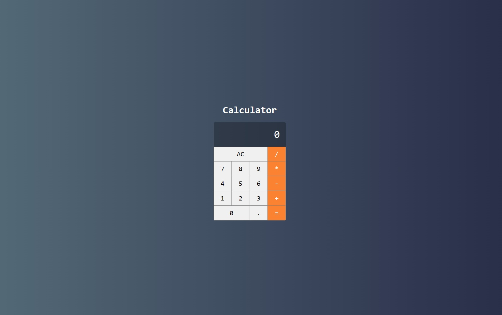

<h4 align="center"> 
	🚧 Calculadora 🚧
</h4>   

 
   

 

## 🎨 Projeto

- Uma calculadora com as principais funcionalidades de somar, subtrair, dividir e multiplicar além dos botões principais de igual, AC ( "Cancel Entry" ou "cancelar registro") e vírgula. Lembrando que deve seguir o design exibido na imagem template para o posicionamento dos botões e display.

## 💻 Tarefas

- [x] 1. Criar projeto
- [x] 2. Componente calculadora
- [x] 3. Componente Button
- [x] 4. Componente Display
- [x] 5. Componente Button
- [x] 6. Implementando a lógica
- [x] 7. Implementando a lógica 

## 🚀 Seções 

- [x] Layout e lógica [43 - 49]   

## 🚀 Construído projeto 

- `npm i -g create-react-app`
- `npx create-react-app calculadora`

## 🚧 Warnings (identificar, pesquisar, programar e testar)
 
- correções 

## 📝 Licença

Este projeto esta sobe a licença MIT.

Feito com ❤️ por Douglas A B Novato 👋🏽 [Entre em contato!](https://www.linkedin.com/in/douglasabnovato/)
 
Fonte do projeto Por Leonardo Moura Leitão no [Curso React + Redux: Fundamentos e 2 Apps do Absoluto ZERO!](https://www.udemy.com/course/react-redux-pt/), [Cod3r](https://www.cod3r.com.br/), [Github Cod3r](https://github.com/cod3rcursos/curso-react-redux)
