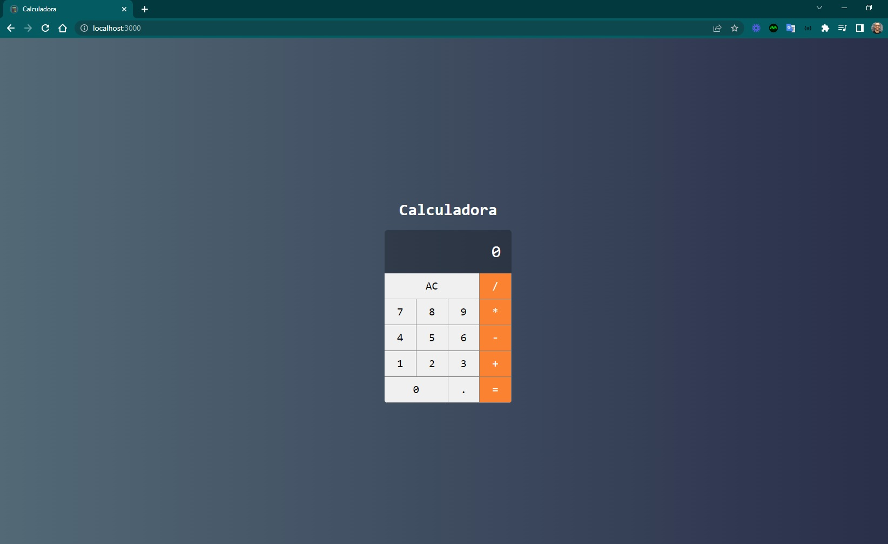

<h4 align="center"> 
  🚧 Calculadora 🚧
</h4>   

 
   

 

## 🎯 Visão do Produto
Desenvolvimento de uma calculadora web responsiva focada em uma excelente experiência de usuário (UX). O projeto evolui de um componente simples para uma Single Page Application (SPA) completa, incorporando um design system inspirado em interfaces de alta conversão, com sistema de alternância de temas (Theme Switcher: Vivo e Dark), cabeçalho (Header) e rodapé (Footer).

## 🏗️ Arquitetura e Engenharia de Software
- **Stack Tecnológica:** React.js, Vanilla CSS.
- **Padrões de Projeto (Design Patterns):**
  - **Componentização (Dumb vs Smart Components):** Separação clara entre componentes de apresentação estática (`Button`, `Display`, `Header`, `Footer`) e o componente de regra de negócio (`Calculator`, `App`).
  - **Single Source of Truth:** O estado da aplicação (valores, operação atual e tema selecionado) reside unicamente nos componentes pais.
  - **CSS Variables & Theming:** Gerenciamento de temas dinâmicos utilizando propriedades customizadas do CSS (`:root` e seletores de dados) controladas pelo estado do React.
- **Segurança (Tratamento de Débito Técnico):** Remoção do uso de funções nativas vulneráveis (`eval()`), substituindo por um parser matemático seguro e isolado.

## 🎨 O Projeto Inicial (MVP)
Uma calculadora com as principais funcionalidades de somar, subtrair, dividir e multiplicar além dos botões principais de igual, AC ("Cancel Entry" ou "cancelar registro") e vírgula. 

## 💻 Plano de Ação (Roadmap de Desenvolvimento)

### Fase 1: Fundação e MVP (Concluído)
- [x] 1. Criar projeto: `npm i -g create-react-app` e `npx create-react-app calculadora`
- [x] 2. Estilização do Componente Calculator: `src/main/Calculator.jsx`
- [x] 3. Estilização do Componente Button: `src/components/Button.jsx` e `src/components/Button.css`
- [x] 4. Estilização do Componente Display: `src/components/Display.jsx`
- [x] 5. Implementando a lógica da calculadora: `src/main/Calculator.jsx`

### Fase 2: Segurança e Engenharia (Próximos Passos)
- [ ] 6. Refatorar a lógica de cálculo (Resolver o warning `no-eval` com um switch/case seguro).

### Fase 3: Redesign e UX (Implementação de Temas)
- [ ] 7. Criar estado global/contexto no `App.js` para o *Theme Switcher* (Vivo vs Dark).
- [ ] 8. Criar o componente `<Header />` com a logo e a chave de alternância de temas.
- [ ] 9. Criar o componente `<Footer />` com créditos e informações.
- [ ] 10. Refatorar `index.css` e `Calculator.css` para utilizar variáveis dinâmicas de cores baseadas no tema escolhido.
- [ ] 11. Ajustar o layout global (Flexbox column) para empilhar Header, Main (Calculadora) e Footer.

## 🚀 Tecnologias e Estratégias Utilizadas
- Favicon personalizado
- Idioma e meta tags configuradas
- Fontes Google Roboto via link
- [Gradiente uiGradients](https://uigradients.com/#CitrusPeel) (Tema Base)
- Variáveis em CSS para escopo de cores
- Estratégia de layout com **CSS Grid** para o `Calculator`
- Estratégia de layout com **Flexbox** para o `Display` e estruturação da página

## 🚧 Débitos Técnicos (Warnings em Monitoramento)
- [eval can be harmful - no-eval](https://eslint.org/docs/latest/rules/no-eval) (Escopado para correção na Fase 2).

## 📝 Licença
Este projeto esta sob a licença MIT.

---
Feito com ❤️ por Douglas A B Novato 👋🏽 [Entre em contato!](https://www.linkedin.com/in/douglasabnovato/)
 
*Fonte original do projeto: Por Leonardo Moura Leitão no [Curso React + Redux: Fundamentos e 2 Apps do Absoluto ZERO!](https://www.udemy.com/course/react-redux-pt/), [Cod3r](https://www.cod3r.com.br/), [Github Cod3r](https://github.com/cod3rcursos/curso-react-redux).*