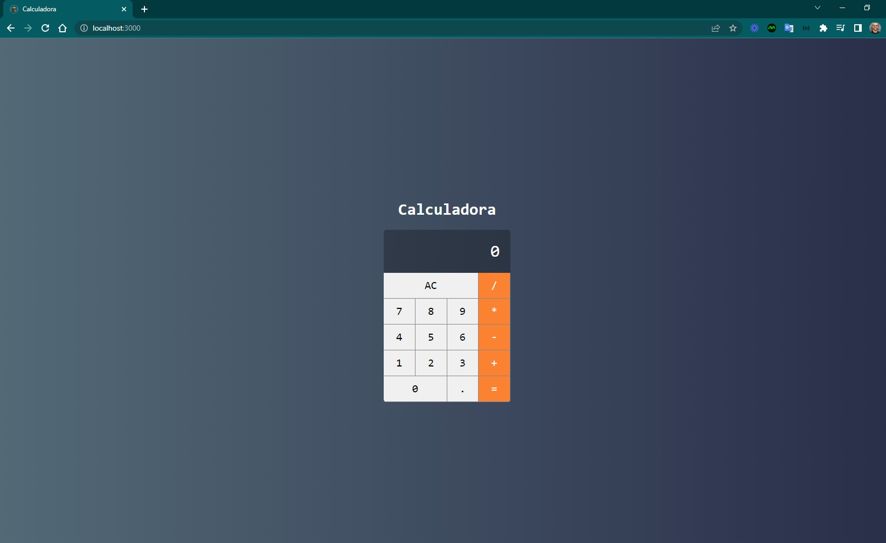

<h4 align="center"> 
	🚧 Calculadora 🚧
</h4>   

 
   

 

## 🎨 Projeto

- Uma calculadora com as principais funcionalidades de somar, subtrair, dividir e multiplicar além dos botões principais de igual, AC ( "Cancel Entry" ou "cancelar registro") e vírgula. Lembrando que deve seguir o design exibido na imagem template para o posicionamento dos botões e display.

## 💻 Tarefas

- [x] 1. Criar projeto: `npm i -g create-react-app` e `npx create-react-app calculadora`
- [x] 2. Estilização do Componente Calculator: src/main/Calculator.jsx
- [x] 3. Estilização do Componente Button: src/components/Button.jsx e src/components/Button.css
- [x] 4. Estilização do Componente Display: src/components/Display.jsx
- [x] 5. Implementando a lógica da calculadora: src/main/Calculator.jsx

## 🚀 Seções 

- [x] Layout e lógica [43 - 49]   

## 🚀 Construído projeto 

- favicon calculadora
- título da página
- idioma da página
- fonts google roboto via link
- [gradiente uigradients](https://uigradients.com/#CitrusPeel)
- variáveis em css
- estratégia do layout com grid css para o Calculator
- estratégia do layout com flexbox para o Display

## 🚧 Warnings (identificar, pesquisar, programar e testar)
 
- [eval can be harmful  no-eval](https://eslint.org/docs/latest/rules/no-eval) 

## 📝 Licença

Este projeto esta sobe a licença MIT.

Feito com ❤️ por Douglas A B Novato 👋🏽 [Entre em contato!](https://www.linkedin.com/in/douglasabnovato/)
 
Fonte do projeto Por Leonardo Moura Leitão no [Curso React + Redux: Fundamentos e 2 Apps do Absoluto ZERO!](https://www.udemy.com/course/react-redux-pt/), [Cod3r](https://www.cod3r.com.br/), [Github Cod3r](https://github.com/cod3rcursos/curso-react-redux)
